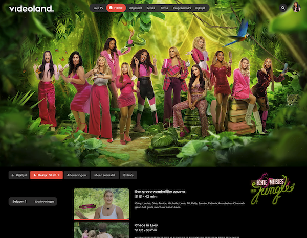

## Setup

After clone.

```shell
cd videoland

npm install 
# or
yarn install
```

## JSON to SCSS
Add JSON-to-SCSS preprocessor for design tokens

### Install
```shell
npm install --global json-to-scss 
````

### Run - after update token file!
```shell
json-to-scss src/resources/design/tokens.json src/resources/styles/tokens/_tokens.scss
```

## .env
Add a `.env.local` file in the **root** of your project based upon the `.env` file in this
package. This will be containing **YOUR** firebase settings:

> Make sure your `.env` vars start with `REACT_APP_`

```dotenv
REACT_APP_API_KEY=YOUR_KEY
REACT_APP_AUTH_DOMAIN=YOUR_AUTH_DOMAIN
REACT_APP_PROJECT_ID=YOUR_PROJECT_ID
REACT_APP_STORAGE_BUCKET=YOUR_STORAGE_BUCKET
REACT_APP_MESSAGING_SENDER_ID=YOUR_MESSAGING_SENDER_ID
REACT_APP_APP_ID=YOUR_REACT_APP_APP_ID
```

> **DON'T** commit your `.env.local` file to GitHub!

## Storybook 
Storybook is set up and ready to go: 
```shell
npm run storybook 
# or 
yarn storybook
```


## Firebase
Execute `firebase init` after installation.

## Chromatic
Execute `npm install --save-dev chromatic` after installation.

## Database Hook
There is a  predefined hook called `useDatabase` in the
`hooks` directory. This hook takes in the name of the collection
to query:

```jsx
import { useDatabase } from './hooks'
...

const [data, isLoaded] = useDatabase('records')
```

## FontAwesome
The [FontAwesome icon library](https://fontawesome.com/v5/docs/web/use-with/react) is already installed

## Bootstrap
[Bootstrap](https://react-bootstrap.github.io/getting-started/introduction) is already installed
